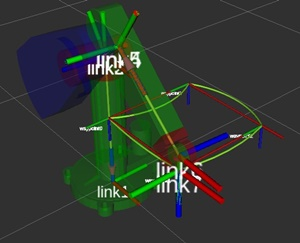
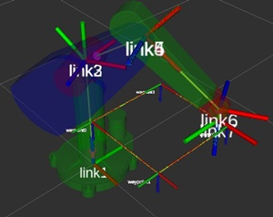

# robotics-course

## Dependencies

- Eigen

  ```sh
  sudo apt install libeigen3-dev
  ```

- Moveit

  ```sh
  sudo apt install ros-melodic-moveit
  ```

- Visual tools

  ```sh
  sudo apt install ros-melodic-moveit-visual-tools ros-melodic-rviz-visual-tools
  ```

- JointStatePublisher, RobotStatePublisher

  ```sh
  sudo apt install ros-melodic-joint-state-publisher ros-melodic-joint-state-publisher-gui ros-melodic-robot-state-publisher
  ```

## Getting Started

### Clone

Clone this repository into your `catkin_ws/src`. ([How to "git clone" including submodules?](https://stackoverflow.com/questions/3796927/how-to-git-clone-including-submodules))

```
git clone --recursive https://github.com/rise-lab-skku/robotics-course.git
```

### Build

- `catkin_make`를 사용해도 되지만 이것보다는 `catkin build`를 더욱 추천.
  - 이미 `catkin_make`를 사용하던 workspace에서 `catkin build`로 바꾸려면 build, devel 폴더를 삭제하고 `catkin build`를 시도하면 된다.
  - `catkin build` 명령어를 찾을 수 없다고 나오는 경우, `sudo apt-get install python-catkin-tools`를 설치하면 된다.

### (Optional) Vscode Include Path

`c_cpp_properties.json`

```json
"includePath": [
    "${workspaceFolder}/**",
    "/opt/ros/melodic/include/**",
    "/usr/include/**",
    "~/catkin_ws/devel/include/**",
],
```

## 폴더별 내용

- g++/eigen_vs_std_matrix
  - [@ryul1206](https://github.com/ryul1206)
  - Eigen vs STL: Matrix calculation
- g++/dh
  - [@ryul1206](https://github.com/ryul1206)
- g++/poe
  - [@ryul1206](https://github.com/ryul1206)
- [puma560_description](https://github.com/nimasarli/puma560_description) (submodule)
- puma560_moveit_config
  - Generated package using MoveIt Assistant
- puma560_w_collision_description
  - [@shinjinjae](https://github.com/shinjinjae)
  - puma560_description + collision model
- puma560_w_collision_moveit_config
  - Generated package using MoveIt Assistant
- rrr_description
  - [@shinjinjae](https://github.com/shinjinjae)
- rrr_moveit_config
  - Generated package using MoveIt Assistant
- pick_n_place
  - [@ryul1206](https://github.com/ryul1206)
  - (Ref.) [MoveIt C++ Tutorial](https://github.com/ros-planning/moveit_tutorials/blob/melodic-devel/doc/move_group_interface/src/move_group_interface_tutorial.cpp)
  - Running the demo
    - `roslaunch pick_n_place demo.launch`
    - `rosrun pick_n_place my_puma`
- traj_plan
  - [@ohilho](https://github.com/ohilho)
  - Implementation of [cubic spline algorithm from Wikipedia](https://en.wikipedia.org/wiki/Spline_(mathematics)#Algorithm_for_computing_natural_cubic_splines)
- turtle_control
  - [@ohilho](https://github.com/ohilho), [@ssw0536](https://github.com/ssw0536)
  - Kalman filter experiments with TurtleBot3
  - Running the demo
    - `roslaunch turtle_control demo.launch`
- kinematics_demo
  - [@ryul1206](https://github.com/ryul1206)
  - fk_node (fk_main.cpp)
    - `roslaunch pick_n_place demo.launch`
    - `rosrun traj_plan traj_plan`
    - `rosrun kinematics_demo fk_node _robot:=puma_560`
    <!-- -  -->
  - ik_node (ik_main.cpp)
    - `roslaunch pick_n_place demo.launch`
    - `rosrun kinematics_demo ik_node _robot:=puma_560`
    - 
  - ik_linear (ik_linear_cartesian.cpp)
    - `roslaunch pick_n_place demo.launch`
    - `rosrun kinematics_demo ik_linear _robot:=puma_560`
    - 
