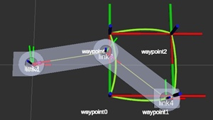
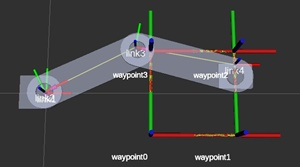

# Robotics Course

> **Note:**
> * **[자주 묻는 질문(FAQ)](https://github.com/rise-lab-skku/robotics-course/wiki/FAQ) 페이지가 생겼습니다.**
> * **그 외 나머지 질문은 [Discussions](https://github.com/rise-lab-skku/robotics-course/discussions)를 이용하시면 편합니다.**
> * 질문에는 가급적 많은 정보를 담아주세요. 저희가 원인을 파악하는 것에 도움이 됩니다. 감사합니다.

1. [Dependencies](#dependencies)
   1. [Manual Installation](#manual-installation)
   2. [Installation via `rosdep`](#installation-via-rosdep)
2. [Getting Started](#getting-started)
   1. [Clone](#clone)
   2. [Build](#build)
   3. [(Optional) Vscode Include Path](#optional-vscode-include-path)
3. [사용되는 로봇 descriptions](#사용되는-로봇-descriptions)
4. [폴더별 내용](#폴더별-내용)
5. [References](#references)

## Dependencies

### Manual Installation

- Eigen (for Kinematics, Pick_n_place, etc.)

  ```sh
  sudo apt install libeigen3-dev
  ```

- Moveit and Visual tools (for Kinematics, Workspace, etc.)

  ```sh
  sudo apt install ros-melodic-moveit\
      ros-melodic-moveit-visual-tools\
      ros-melodic-rviz-visual-tools\
      ros-melodic-joint-state-publisher\
      ros-melodic-joint-state-publisher-gui\
      ros-melodic-robot-state-publisher
  ```

- yaml-cpp (for IMU tutorial)

  ```sh
  mkdir ~/external_libs; cd ~/external_libs
  git clone https://github.com/jbeder/yaml-cpp.git
  mkdir yaml-cpp/build; cd yaml-cpp/build
  cmake ..
  ```

- Controller interface (for OpenBase)

  ```sh
  sudo apt install ros-melodic-controller-interface\
      ros-melodic-effort-controllers\
      ros-melodic-joint-state-controller\
      ros-melodic-gazebo-msgs
  ```

- PCL (for Lidar tutorial)

  ```sh
  sudo apt install ros-melodic-pcl-conversions\
      ros-melodic-pcl-ros
  ```

- gTest (for kinematics_demo)

  ```sh
  sudo apt install libgtest-dev cmake
  cd /usr/src/gtest
  sudo cmake CMakeLists.txt
  sudo make
  sudo cp *.a /usr/lib
  ```

- Turtlebot3 packages (for turtlebot_path_tracker)

  ```sh
  sudo apt install ros-melodic-navigation ros-melodic-gazebo-ros
  ```

  - 참고로 `turtlebot3-fake` 패키지도 필요한데, 이 패키지는 강의자료의 내용에 따라 수정되어야 하므로 `apt install`로 설치하지 않습니다. 대신 [Getting Started](#getting-started)에 적힌 순서에 따라 본 저장소를 빌드하여 사용합니다.
  - 수정된 `turtlebot3-fake`는 `turtlebot3_simulations` 폴더에 있습니다.

### Installation via `rosdep`

[http://wiki.ros.org/rosdep](http://wiki.ros.org/rosdep)

## Getting Started

### Clone

Clone this repository into your `catkin_ws/src`. ([How to "git clone" including submodules?](https://stackoverflow.com/questions/3796927/how-to-git-clone-including-submodules))

```sh
git clone --recursive https://github.com/rise-lab-skku/robotics-course.git
```

### Build

`catkin_make`를 사용해도 되지만 이것보다는 `catkin build`를 더욱 추천.

- 이미 `catkin_make`를 사용하던 workspace에서 `catkin build`로 바꾸려면 build, devel 폴더를 삭제하고 `catkin build`를 시도하면 된다.
- `catkin build` 명령어를 찾을 수 없다고 나오는 경우, `sudo apt-get install python-catkin-tools`를 설치하면 된다.
- 병렬적으로 빌드하려는 경우, `catkin build -j32` (최대 32개의 job을 동시에 빌드)
- 특정 패키지만 빌드하려는 경우, `catkin build {패키지 이름}`

### (Optional) Vscode Include Path

`c_cpp_properties.json`

```json
"includePath": [
    "${workspaceFolder}/**",
    "/opt/ros/melodic/include/**",
    "/usr/include/**",
    "~/catkin_ws/devel/include/**",
],
```

## 사용되는 로봇 descriptions

robots 폴더 내용

- puma560_description
  - Forked from [nimasarli/puma560_description](https://github.com/nimasarli/puma560_description)
  - urdf에 `<collision>`태그가 아예 없으면 moveit이 `<visual>`태그로 충돌을 감지하기 때문에, 충돌을 무시하려면 `<collision>`태그에 더미를 넣어야 함
- puma560_moveit_config
  - Generated package using MoveIt Assistant
  - Planning group name: `puma_560`
- puma560_w_collision_description
  - [@shinjinjae](https://github.com/shinjinjae)
  - puma560_description + collision model
- puma560_w_collision_moveit_config
  - Generated package using MoveIt Assistant
  - Planning group name: `puma_560`
- rrr_description
  - [@shinjinjae](https://github.com/shinjinjae)
- rrr_moveit_config
  - Generated package using MoveIt Assistant
  - Planning group name: `rrr`
- scara_description
  - [@shinjinjae](https://github.com/shinjinjae)
- scara_moveit_config
  - Generated package using MoveIt Assistant
  - Planning group name: `scara`

## 폴더별 내용

- calibration_demo
  - [@ryul1206](https://github.com/ryul1206), [@kws1611](https://github.com/rladntjd)
  - IMU calibration tutorial
- g++/{ Eigen_vs_STL, DH, PoE }
  - [@ryul1206](https://github.com/ryul1206)
- kinematics_demo/{ so3, se3 }
  - [@ohilho](https://github.com/ohilho) (https://github.com/ohilho/PoseRepresentationLibrary)
- kinematics_demo
  - singularity (singularity.cpp)
    - [@ohilho](https://github.com/ohilho), [@ssw0536](https://github.com/ssw0536), [@shinjinjae](https://github.com/shinjinjae), @Seung Won Lee, [@ryul1206](https://github.com/ryul1206)
  - fk_node (fk_main.cpp): Implemented for Puma560 and RRR
    - [@ryul1206](https://github.com/ryul1206)
  - ik_node (ik_main.cpp): Implemented for Puma560 and RRR
    - [@ryul1206](https://github.com/ryul1206)
    -  
  - ik_linear (ik_linear_cartesian.cpp): Implemented for Puma560 and RRR
    - [@ryul1206](https://github.com/ryul1206)
    -  
- lidar_roi_example
  - [@jiyou384](https://github.com/jiyou384)
  - Velodyne Puck lidar + PCL library tutorial
- OpenBase (submodule URL: [rise-lab-skku/OpenBase](https://github.com/rise-lab-skku/OpenBase))
  - [@HukoOo](https://github.com/HukoOo), [@ryul1206](https://github.com/ryul1206), [@caro33](https://github.com/caro33), [@shinjinjae](https://github.com/shinjinjae)
  - Modified from [GuiRitter/OpenBase](https://github.com/GuiRitter/OpenBase)
- pick_n_place
  - [@ryul1206](https://github.com/ryul1206) (Reference: [MoveIt C++ Tutorial](https://github.com/ros-planning/moveit_tutorials/blob/melodic-devel/doc/move_group_interface/src/move_group_interface_tutorial.cpp))
  - Demo: `roslaunch pick_n_place demo.launch` and `rosrun pick_n_place my_puma`
- rosbag_archive
  - [@shinjinjae](https://github.com/shinjinjae), [@kws1611](https://github.com/rladntjd), [@ssw0536](https://github.com/ssw0536), [@jiyou384](https://github.com/jiyou384)
  - `rosbag play ***.bag` (or `rosbag play -l ***.bag`)
  - rosbag_archive 폴더만 다운받는 [링크](https://minhaskamal.github.io/DownGit/#/home?url=https://github.com/rise-lab-skku/robotics-course/tree/main/rosbag_archive)
- simscape_demo
  - [@shinjinjae](https://github.com/shinjinjae), [@ryul1206](https://github.com/ryul1206)
  - ROS + Matlab + Simscape + Solidworks tutorial
- traj_plan
  - [@ohilho](https://github.com/ohilho)
  - Implementation of [cubic spline algorithm from Wikipedia](https://en.wikipedia.org/wiki/Spline_(mathematics)#Algorithm_for_computing_natural_cubic_splines)
  - traj_plan 폴더만 다운받는 [링크](https://minhaskamal.github.io/DownGit/#/home?url=https://github.com/rise-lab-skku/robotics-course/tree/main/traj_plan)
- turtle_control
  - [@ohilho](https://github.com/ohilho), [@ssw0536](https://github.com/ssw0536)
  - Kalman filter experiments with TurtleBot3
  - Demo: `roslaunch turtle_control demo.launch`
  - turtle_control/bag 폴더만 다운받는 [링크](https://minhaskamal.github.io/DownGit/#/home?url=https://github.com/rise-lab-skku/robotics-course/tree/main/turtle_control/bag)
- turtlebot_path_tracker
  - [@shinjinjae](https://github.com/shinjinjae)
- turtlebot3 (submodule URL: [rise-lab-skku/turtlebot3](https://github.com/rise-lab-skku/turtlebot3))
  - Forked from [ROBOTIS-GIT/turtlebot3](https://github.com/ROBOTIS-GIT/turtlebot3)
- turtlebot3_msgs (submodule URL: [rise-lab-skku/turtlebot3_msgs](https://github.com/rise-lab-skku/turtlebot3_msgs))
  - Forked from [ROBOTIS-GIT/turtlebot3_msgs](https://github.com/ROBOTIS-GIT/turtlebot3_msgs)
- turtlebot3_simulations (submodule URL: [rise-lab-skku/turtlebot3_simulations](https://github.com/rise-lab-skku/turtlebot3_simulations) `robotics-course` branch)
  - [@ryul1206](https://github.com/ryul1206)
  - Modified from [ROBOTIS-GIT/turtlebot3_simulations](https://github.com/ROBOTIS-GIT/turtlebot3_simulations)
- workspace
  - [@ryul1206](https://github.com/ryul1206)
  - Workspace drawing tutorial

## References

- [MoveIt C++ Doxygen (Melodic)](https://docs.ros.org/en/melodic/api/moveit_core/html/cpp/index.html)
